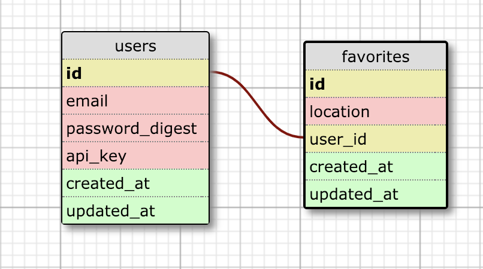

# README
## Sweater Weather

Sweater Weather is a Ruby on Rails API that provides Fast JsonAPI formatted endpoints for weather data, based on location. This app uses the Google geo-coding API to return geographical coordinates for a location, and the Dark Sky weather API to return weather data, based on coordinates. It was built by Dan Hutchinson (github: DanHutch) as a final solo project for Module 3 of the Back-End Engineering program at the Turing School.

This project was built using Rails v5.2.2,  Ruby v2.4.1, and PostgresQL v11.1 and comes with all the necessary gems in the Gemfile. After forking and cloning the repo, simply run `bundle` from the command line.

### Setup:

First, clone this repo:

```
git clone git@github.com:DanHutch/sweater_weather.git
```
Then, run `bundle` from the command line, from within the project directory. Then, you can create the database and schema using `rake db:{create,migrate}`.

If done properly, you should now be able to run the local test suite using the command `bundle exec rspec`.

*This app requires API keys for both the Google geocoding API and the Dark Sky weather API in order to function. In the development of Sweater Weather, `gem 'figaro'` was used to hide API keys in testing and development, and is recommended for this purpose.*

Once API keys have been properly stored in the environment, you can delete the spec casettes and run `bundle exec rspec` to verify service functionality.

### Gems:

- rails
- bcrypt
- pry
- pg
- puma
- fast_jsonapi
- faraday
- figaro
- bootsnap
- byebug
- fuubar
- rspec-rails
- shoulda-matchers
- simplecov
- vcr
- webmock
- listen
- spring
- spring-watcher-listen
- tzinfo-data

### Schema:



### API Endpoints:

1. **Weather for a City**
   -

### Contributing:

In order to contribute, please fork this repo, then clone your new repo and create a branch for your feature.

Please make sure to test your feature fully, using RSpec, before commiting your changes and pushing to your own repo, then create and submit a pull request back to this repository.

Please contact Dan Hutchinson (DanHutch) via GitHub, if you have any questions, etc.
